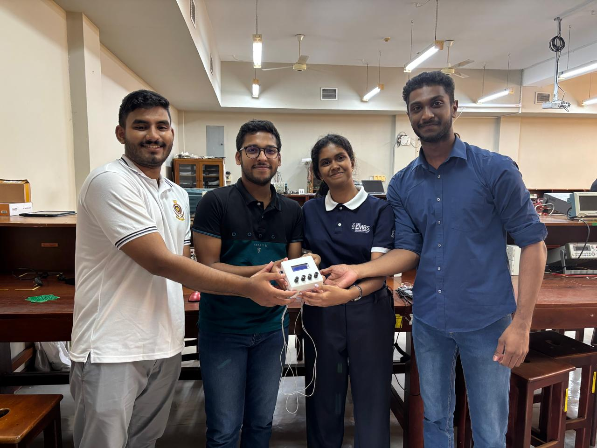

# 🫀 Meditrones: A Biomedical Device Design for Affordable Holter Monitoring

  

## 💡 Project Overview

This project was carried out as part of the *BM2210 Biomedical Device Design* course. The goal was not just to build a product but to rigorously apply the biomedical device design process — from need-finding to prototyping — to address a critical healthcare gap in Sri Lanka: affordable, continuous cardiac monitoring.

---

## 🏥 Problem Statement

> “There is a need for an affordable and reliable continuous ECG monitor with a mobile app interface in Sri Lankan hospitals to improve access to continuous heart monitoring, enhance cardiac care, and address the limitations of current costly devices.”

Current Holter monitors are expensive and scarce in many public hospitals. This project aims to provide an accessible alternative by integrating ECG acquisition hardware with a mobile application to streamline data access and patient monitoring.

---

## 🔍 Design Journey Highlights

### 🔬 Investigation & Needs Finding

We explored multiple unmet needs in local hospitals and healthcare settings. After systematic screening, the need for an affordable, app-integrated Holter monitor was selected due to its feasibility, socio-economic relevance, and alignment with our team's expertise.

### ⚙️ Concept Development

Four concepts were initially brainstormed and evaluated:
- Smartphone-dependent Holter monitor
- Standalone 3-lead monitor
- Patch-based disposable monitor
- AI-integrated multi-lead monitor

Using screening matrices (risk, IP, regulation, business model), the smartphone-integrated concept was selected as the most feasible given our constraints.

---

## 🧠 System Architecture

### Key Modules
- **AD8232 ECG Module**: Signal acquisition
- **ESP32 Microcontroller**: Signal processing, wireless communication (BLE/Wi-Fi)
- **SD Card Module**: Local data storage
- **Mobile Application**: Real-time display, cloud storage, user-friendly interface

### Functional Flow
1. ECG signal acquisition →  
2. Wireless data transmission to app via ESP32 →  
3. Visualization and remote monitoring using React-based mobile app →  
4. Optional local SD storage for redundancy

---

## 📲 Mobile App Interface

Built with **React**, the app offers:
- Real-time ECG visualization
- Heart rate monitoring
- Cloud data storage integration
- Clean, responsive UI for healthcare providers

---

## 🧭 Key Takeaways

- This project emphasized the **entire biomedical design cycle**, including problem definition, ideation, concept screening, prototyping, and evaluation.
- It demonstrated how **low-cost components** and **interdisciplinary thinking** can be used to develop impactful healthcare technologies.
- While not yet a certified product, the project lays the groundwork for future development and clinical deployment.

